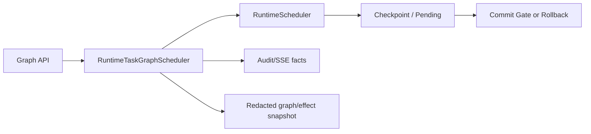

# 2. 架构与风险自适应运行时

## V2 Graph 运行路径

`POST /api/task-graphs` 只注册 Graph 并启动后台任务；全部节点仍由
`RuntimeTaskGraphScheduler` 调度，并且该 Scheduler 是进入 Runtime Scheduler 的唯一工具执行入口。
状态只在进程内保存：服务重启后不会宣称能恢复正在执行的 Graph。

Graph snapshot 仅包含 node ID、request/step ID、状态、checkpoint ID、error code、阻断原因和时间；
不返回工具原始 output、artifact 内容或 chain-of-thought。审批通过或拒绝后由冻结的 resume 路径推进；
取消 Graph 会 fence 等待审批节点，已取消 Graph 的 resume fail-closed。

## 组长 Graph Benchmark 证据

- Run ID：`v2-graph-7d4d7c2-20260730`
- 代码提交：`7d4d7c2847d81275aadd104d3b9151aad7111da2`
- 日期：2026-07-30；每个 fixture/mode 3 次重复，共 18 条记录。
- Raw：[JSONL](../../experiments/v2/results/raw/v2-graph-7d4d7c2-20260730.jsonl) 与 [CSV](../../experiments/v2/results/raw/v2-graph-7d4d7c2-20260730.csv)
- Derived：[聚合结果](../../experiments/v2/results/derived/v2-graph-7d4d7c2-20260730-summary.json)

Fixture 使用无副作用、固定时延的受控 Runtime handler，但真实运行
`RuntimeTaskGraphScheduler`、Graph 状态与 Audit；runner 对依赖、同 effect target 串行化、
Full Guard 全局暂停和 Adaptive 等待期间独立节点推进逐次断言。所有 timing 来自
`perf_counter_ns`，不以异常或预期状态填充事实。

本轮只沉淀证据，不在最终全量实验前给出跨模块宣传式百分比结论。

## 同节点 controlled speculative overlap 的边界

**NOT_SUPPORTED。** `SandboxFlow` 有仅供受控中断测试的可选 execution-monitor hook，
但正式 Live container 没有接入独立、安全且可审计的同节点 checker；把现有 pre-check
重复并行执行不能构成新的安全验证。因此没有 implementation + 正式 benchmark raw data 的闭环，
报告不将其描述为已完成能力。当前可证明的并行能力仅为 sibling TaskGraph 的依赖/冲突/审批感知调度。
