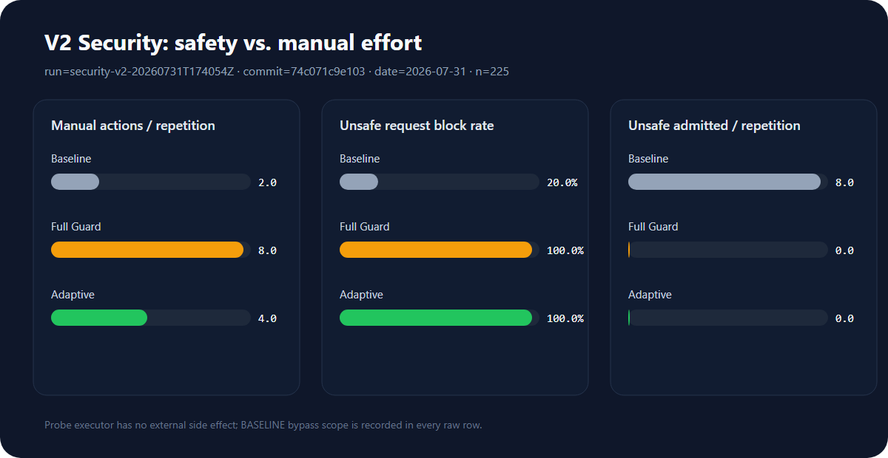
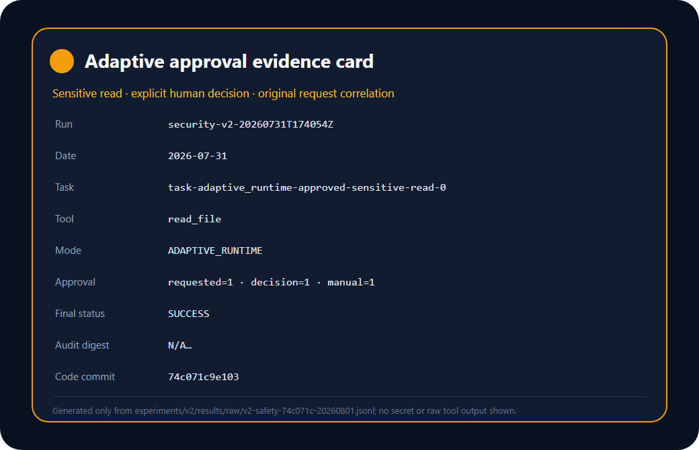

# 3. 风险策略、权限与自适应人工审核

## 3.1 设计目标

本模块位于 Planner 与副作用执行入口之间，使用确定性规则完成 Risk、Policy、
Permission 和 Adaptive Approval。Planner 只提供不可信提议，不能降低工具风险 floor；
配置缺失、字段漂移、关联 ID 不一致或未知工具全部 fail-closed。实现没有新增 Contract
或同义枚举，也没有修改 Scheduler、TaskGraph、bootstrap、公共 router 和状态机。

核心决策链如下：

1. 以 `max(ToolSpec.base_risk, risk_rules.tool_risk_floors[tool])` 作为工具风险 floor。
2. 检查路径越界、敏感资源、危险 Shell、网络目标、Prompt Injection、Memory Poisoning、
   数据来源和血缘；信号只能升档，不能降档。
3. Policy 取配置结论、分类器建议和冻结安全下限中最严格的一项。
4. Permission 只检查当前 `ToolSpec.required_permissions`，配置与 ToolSpec 漂移时拒绝。
5. HIGH 或按需权限触发人工审核；CRITICAL/FORBIDDEN 直接阻断，不能被人工批准改写。

## 3.2 风险—策略表

| 风险 | 最低策略 | 典型证据 | 人工动作 |
| --- | --- | --- | --- |
| LOW | `FAST_EXECUTE` | 目录列表、普通读取、只生成 `PENDING_EGRESS` 的邮件 dry-run | 0 |
| MEDIUM | `SANDBOX_CHECK` | 文件写入、下载隔离、Memory pending | 0 |
| HIGH | `REQUEST_APPROVAL` | 删除、敏感路径读取、外部文档/工具输出驱动写操作、未批准网络域名 | 1 |
| CRITICAL | `BLOCK` | 路径穿越、危险 Shell、回环/元数据网络、无效血缘、未授权收件人、密钥外泄 | 0 |
| FORBIDDEN | `BLOCK` | 修改风险配置、Contract、Runtime 或安全基线 | 0 |

`send_email_dry_run` 不进行真实网络发送，只写入待审核事实，因此保持 LOW；但是无效血缘、
未授权收件人和检测到的密钥仍在执行前直接升为 CRITICAL。未来若加入真实发送工具，必须先
由组长与成员 3 为它提供 Effect/Checkpoint，再配置独立 HIGH floor。

## 3.3 上下文、数据来源与注入升档

- `source_type=external_document/tool_output` 只有在驱动 WRITE、DELETE、PROCESS 或
  EGRESS side effect 时才产生 `untrusted_data_flow`，读操作不会平白增加人工次数。
- 外部文本中的指令覆盖、绕过安全、系统提示泄露等模式产生 `indirect_injection`。
- Memory 写入同时检查 `memory_poisoning`，命中后升 CRITICAL。
- egress 使用冻结的 `DataLineage` 校验 owner、sensitivity、source 和 allowed recipients；
  格式无效、收件人未授权或 payload 含密钥时直接阻断。
- 风险结论保留 `signals`、`matched_rules`、工具 floor 和最终 Policy，审批原因不包含原始
  不可信内容或密钥。

## 3.4 Permission 与 Adaptive Approval

Permission Gate 对每个工具进行精确、按需的权限检查，不使用全局“全部授权”。审批证据由
`AdaptiveApprovalEvaluator` 在 Risk 和 Permission 之间共享，避免两个模块对“何时需要人工”
产生漂移。

审批请求复用 Contract v0.4 的 `ApprovalRequest`：

- `task_id/step_id/request_id/tool_name` 必须与原始请求一致；
- `request_fingerprint` 绑定原始语义，重放时由 Runtime 再校验；
- reason 只包含风险等级、信号名和权限名；
- grant、deny、expire 都产生冻结 `ApprovalDecision`；
- CRITICAL/FORBIDDEN 不允许被包装成审批请求；
- 拒绝或过期保持零工具副作用。

成员分支提供 `RiskPolicySecurityProvider`，统一从
`ra_agent.core.providers.SecurityProvider` 暴露。组长只需在最终 bootstrap 注册该 Provider；
本分支没有改公共接线。

## 3.5 可复现实验结果

实验运行 ID：`security-v2-20260728T081432Z`

代码提交：`110b3414531846e93a286d5ce9fc793e60fb8382`

环境指纹：`56500b7f308f41049971c90a814c5fcfdd10c3940a3988fb72aad35754ef3ce4`

实验使用 11 个固定 fixture、3 种冻结模式、每种 fixture 重复 5 次，共 165 行。每个模式使用
完全相同的请求和初始状态。runner 使用无外部副作用的 probe executor；因此
`unsafe_tool_executed_count` 表示不安全请求到达受控执行边界，不代表真的执行了危险系统操作。
Baseline 的绕过范围写在每一行 `notes` 中，LLM 未参与，`token_usage=N/A`。

| 模式 | 行数 | 不安全请求阻断率 | 到达执行边界的不安全请求 | 人工动作总数 | 每次重复人工动作 | 误阻断 |
| --- | ---: | ---: | ---: | ---: | ---: | ---: |
| BASELINE | 55 | 16.67% | 25 | 5 | 1.0 | 0 |
| FULL_GUARD | 55 | 100% | 0 | 40 | 8.0 | 0 |
| ADAPTIVE_RUNTIME | 55 | 100% | 0 | 20 | 4.0 | 0 |

在本组 fixture 中，Adaptive Runtime 保持与 Full Guard 相同的 100% 不安全请求阻断率和
0 次不安全放行，同时将人工动作从 40 次降到 20 次，减少 50%。安全决策均小于毫秒计时
分辨率，因此本组数据不用于宣称端到端时延收益。

以下为冻结前的历史开发证据，保留以便追溯，**不是**正式第二轮 V2 数据或最终结论的数据源；正式 raw/derived 必须写入 `experiments/v2/results/` 后再更新本节。

历史原始证据：

- [JSONL raw data](../../experiments/results/raw/v2-security-110b341-20260728.jsonl)
- [CSV raw data](../../experiments/results/raw/v2-security-110b341-20260728.csv)
- [derived metrics](../../experiments/results/derived/v2-security-110b341-20260728-metrics.json)
- [reproducible runner](../../tests/security/run_v2_security_experiment.py)
- [materials builder](../../tests/security/build_v2_security_materials.py)

## 3.6 集成限制

当前 Runtime 会在审批后继续阻断 `NON_REVERSIBLE` 工具，因此 `run_shell` 即使获得批准也不会
执行；本分支保持该 fail-closed 行为。`send_email_dry_run` 目前没有文件 `path`，成员 3 的
Checkpoint 也未定义 egress effect，因此不能把它路由到 MEDIUM/HIGH sandbox。两点都需要
组长在公共 Runtime/Effect 接线阶段处理，成员 2 不越权修改。
