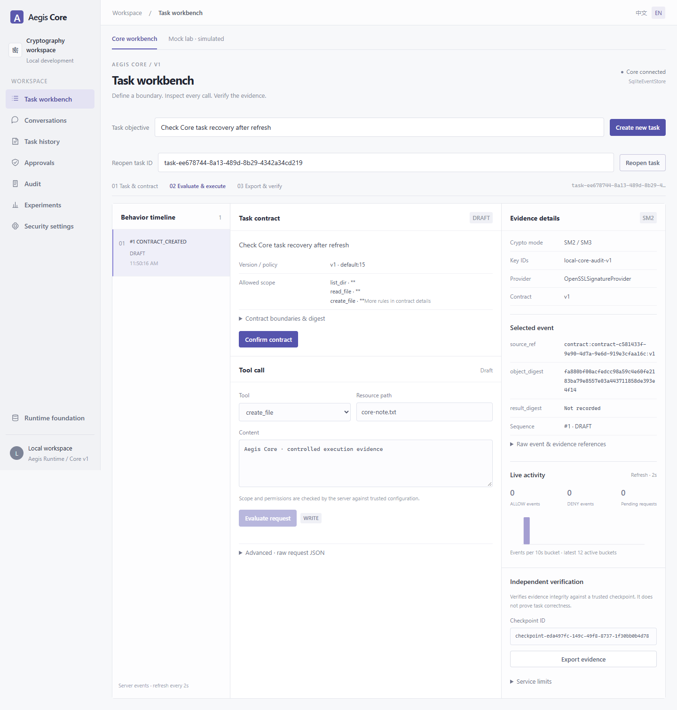
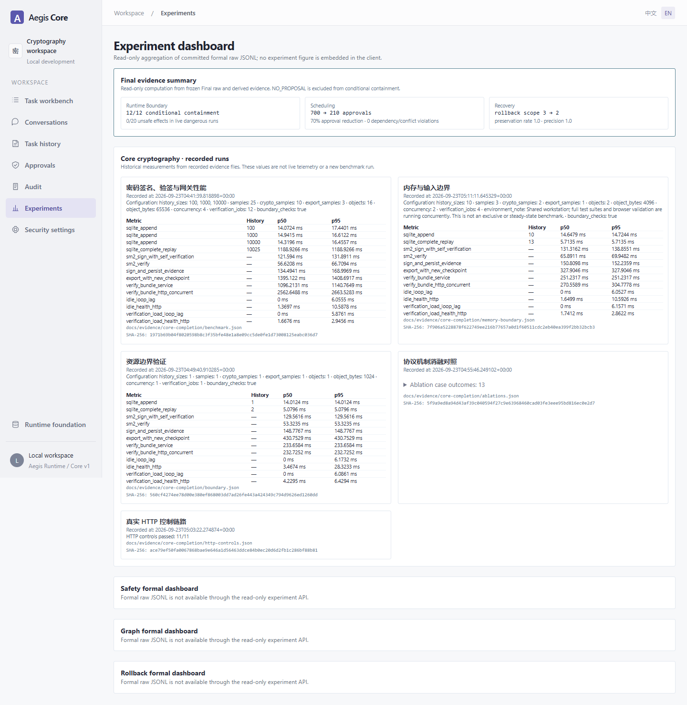
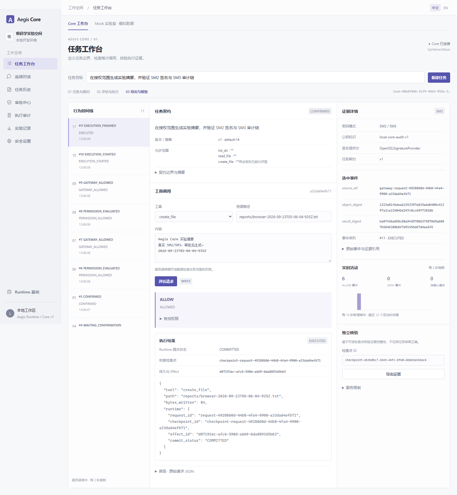

# Core 共通线优化与实验验证

## 2026-09-26 真实链路复核

补充后端修复后的最终本地整体验证：后端 **1236 passed / 8 skipped**（249.49 秒，1 条既有 Starlette 弃用提示）；前端 **81 passed**，16 个测试文件。Ruff、Pyright、ESLint、TypeScript 和 Vite 构建通过。跳过项未计为通过；本轮未运行真实 LLM 规划器或远程邮箱发送。CI 另配置 Ubuntu/Windows 后端、前端和 Chromium 真实 SM2 流程，远端状态以 PR checks 为准。

最终补查覆盖并发额度误拒绝、同时重试重复回滚、事件/证据/检查点写入取消、固定检查点导出重试、日志损坏错误映射、非 UTF-8 读取和实验时间来源。完整说明见 [成员 3 本轮交付](CORE_MEMBER3_DELIVERY_2026-09-26.md)。最新真实服务实验于 04:11 UTC 运行，原始日志、截图、响应及公钥离线复验见 [final 证据清单](../evidence/core-scan-0926/final/manifest.json)；上一级目录保留此前 1220 项回归及早一轮真实服务证据。

CI 复核还修正了并发审计用例对 100 次磁盘提交设置的 5 秒硬超时。该一致性用例保留 100 次并发请求，将死锁等待上限设为 30 秒，增加持久化读回内容/序号/ID 的一致性断言；每次提交延迟 120 ms 的注入在原测试下失败，更新后 7.52 秒通过。相关 7 项带覆盖率测试通过，生产代码不变，定向数量不累加到上述全量计数。

本轮在启动的真实 SM2 后端、Vite 前端和 Edge 浏览器上完成：18 个主流程检查；创建、刷新恢复、按编号重开任务；5 组历史 Core 实验展示；16 类 HTTP 控制实验。HTTP 实验包含先写入后收紧额度、重复契约确认、实际策略版本、并发追加/分页/导出和审批请求恢复。直接核对真实文件内容、提交回执和独立核验结果，未替换 HTTP 或密码实现为 Mock。

主流程同一任务执行两次，历史从 11 增为 20 条事件；旧包与新包分别使用独立保存的检查点均核验通过，篡改副本失败。公钥离线 CLI 验证 20 条事件成功，篡改副本返回 `CHAIN_INVALID`、退出码 1；`tail_complete=false` 的边界不变。

原始材料见 [浏览器记录](../evidence/core-scan-0926/browser-result.json)、[HTTP 16 类结果](../evidence/core-scan-0926/http-controls.json)、[HTTP 原始响应](../evidence/core-scan-0926/http-trace.json)、[刷新与实验页面记录](../evidence/core-scan-0926/frontend-result.json)、[文件哈希清单](../evidence/core-scan-0926/manifest.json)。密钥仅包含公开密钥，私钥留在本地忽略目录。





新的一键实验会启动独立目录、随机端口的两个真实服务，用完关闭，不覆盖平时演示环境。它仍是自动化实验，组员须再按下方页面步骤亲自操作：

```powershell
# 仓库根目录；已安装 Python/前端依赖。Windows 使用已安装 Edge。
backend/.venv/Scripts/python.exe scripts/smoke_core.py --channel msedge --script scripts/verify_core_browser.mjs --script scripts/verify_frontend_additions.mjs --script scripts/verify_core_controls.py
```

日常操作新增两步：执行后刷新当前 `/core?task_id=...` 页面，核对任务/请求和事件仍在；打开“实验”查看 Core 历史记录的来源、配置、采样时间和摘要。图页面遇到恢复失败时会显示原因，修正根因后点击“重试失败恢复”，不会自动反复执行恢复。

范围：在组长的 C1–C7 共通线上改进真实链路，保留公共字段和密码字节协议。分支 `experiment/core-hardening-preview`；基于原 PR #5 的 `501ddcb`。本轮不实现 Cap、持有者证明或零知识证明；实现现有 task/profile 的取消与权限收紧一致性，不冒称已具备能力令牌撤销协议。

**2026-09-23 最终实现更新：** 此前复审中的 R1–R8 已修复，并接通 Core 与原 Runtime 的真实检查点/提交/Effect/恢复流程。逐项变更及准确边界见 [交付状态](CORE_HARDENING_HANDOFF.md)。本次增加真实 HTTP 控制实验、浏览器继续执行与新检查点验证、密码学性能及机制消融，原始数据随仓库保存。

## 改了哪些问题

| 问题 | 修改与实际作用 | 计划对应 |
| --- | --- | --- |
| 调用者可自填宽权限、工具元数据与真实副作用不一致 | HTTP 根据服务端 Profile、Skill 工具清单、系统规则生成上限；调用者权限只能收紧。工具、动作、效果、参数资源必须一致；拒绝目录联接/符号链接别名跨范围。配置保存、取消与受控执行由跨进程接纳锁排序，保存成功后的调用读取新权限。 | C2、C3、C4 |
| 同 ID 换参数、审批后改请求、重启丢状态、并发重复执行 | 完整请求指纹与不可变快照绑定；契约/审批/会话/请求持久化；SQLite 原子执行占位与结果缓存；ONE_SHOT 与当前授权复查。失败结果不明时不自动重试。 | C2、C3、C4 |
| 事件存储反复扫描全部历史、并发追加序号竞争 | SQLite 按任务索引，事务内保存序号、事件和 SM3 链；可选尾事件查询避免每次追加重读历史。旧 JSONL 验链后一次导入并保留原文件。 | C5 |
| 目录与文件读取未真正遵循部署上限 | Core 目录上限加一即拒绝；原 Runtime 返回有界扫描子集和 truncated。文件按字节上限加一读取并复验，覆盖 stat 后文件增长。 | C4 |
| 大证据包导出/CLI 限制不一致、重复签名、同步核验卡住服务 | 统一 64 MiB 紧凑 JSON 证据边界，HTTP 解析前计数限流；复用经核验的同一不可变签名对象；核验/导出重计算移出事件循环，限制并发核验任务；环境不可用与证据无效分开报告。 | C6 |
| 前端真实流程需要手填 ID，模拟与真实容易混淆 | 增加真实任务→契约→评估/审批→执行→证据核验引导，保留独立 Mock 实验室；实际 SM2 模式、密钥标识、事件与摘要可见。 | C7 |
| 页面输入、跳转、分页与指标错误 | 修复超过 100 条事件后的旧审批、审计 URL 覆盖、多行权限、中文 IME 回车、安全配置错误重试、API/SSE 地址、审批任务跳转、回滚成功率分母。 | C1、C7 |
| 仓库入口与新共通线脱节、目录名乱码 | README 增加真实 Core 启动路径；本地启动器隔离实验数据；历史策划书仅修复文件名，不改内容、不删除原 Runtime。 | C1 |

## 本轮补齐的执行闭环

真实网关响应现在包含实际提交的 checkpoint/effect ID；它们可在旧任务 Effect 查询和历史页面中交叉核对。文件与记忆写入复用 Runtime 提交及恢复，取消和深检拒绝不会留下假回滚状态。Profile 总额度按任务累计，切换 Skill/工具不能绕过；Windows 文件拒绝规则与文件系统大小写一致。

11 类真实 HTTP 控制实验覆盖：变参、四路并发重试、共享 Runtime Effect、零对象额度、字节额度、取消后调用、错误任务绑定、跨工具与 Skill 总额度、执行前权限收紧、Windows 大小写、原件/篡改核验。每项直接检查真实文件或持久化状态，不以按钮禁用代替服务端结果。

```powershell
# 已按下文启动后端后，在仓库根目录运行。使用独立实验 profile 与新文件。
backend/.venv/Scripts/python.exe scripts/verify_core_controls.py
# 对照与性能实验使用隔离目录，不读取演示私钥。
backend/.venv/Scripts/python.exe scripts/experiment_core_ablations.py
backend/.venv/Scripts/python.exe scripts/benchmark_core.py
```

完整包维持 64 MiB 上限。前端继续执行后导出新 checkpoint，保留旧包对应的旧锚点；超限仍明确拒绝。这里没有引入新分段证据协议。

## 公共接口与可信边界

`TaskContractV2`、`PermissionGrant`、`ToolCallEnvelope`、`GatewayDecision`、`BehaviorEvent`、六字段 `SignedEnvelope` / `AuditCheckpoint` 和冻结 fixtures 保持不变。`SignatureProvider` 方法与 JCS/SM3/SM2 域分离、参数、编码仍见 [公共密码接口](../interfaces/crypto_audit_v1.md)。新增 SQLite 是内部实现，原 EventStore 三方法仍可用。

HTTP 请求的三组空权限数组使用服务端默认授权；提供非空权限只能进一步限制服务端上限。`configs/core_skills.json` 是部署方控制的工具清单，不从 Agent 请求读取定义。原方法签名保留；新增构造参数都是可选的内部注入点。

本地开发属于单操作员可信后端：尚无生产认证、多租户或独立密钥服务。Opaque gateway handle 防止误接线，不是对同进程恶意 Python 代码的安全隔离。旧 Runtime 入口仍保留其原有检查点/回滚/调度语义，不能声称已经通过 Core SM2 证据链。磁盘管理员改变工作区或密钥的能力不在当前隔离保证内。

## 自己从界面跑一遍

1. 按 [README](../../README.md) 开两个终端，启动 `scripts/start_core.py` 与前端。打开首页，确认 `SM2 / SM3`、`OpenSSLSignatureProvider`、真实公钥标识。无需配置 LLM。
2. 若要演示人工审批，在“安全设置”的附加审批动作中加入 `create_file`，保存后回首页创建新任务。修改的是本地 `.runtime/core-demo/` 实验配置。
3. 输入“在授权范围生成实验摘要，并验证 SM2 签名与 SM3 审计链”，创建任务。展开契约详情审阅允许范围、禁止规则与版本，再点“确认契约”。
4. 选择 `create_file`，路径填 `reports/my-first-run.txt`，写入一段自己能辨认的文字，点击“评估请求”。要求审批时应出现 `REQUIRE_CONFIRMATION`；此时对应文件尚不存在。
5. 点“批准并重新检查”，显示 `ALLOW` 后点“执行工具”。在 `.runtime/core-demo/workspace/reports/` 找到实际文件，核对内容。再查看左侧事件及右侧签名对象摘要。
6. 点“导出证据”“核验原件”，应显示通过。点“制作篡改副本”“核验副本”，应显示失败及具体错误；原件保持不变。
7. 在新请求里选 `delete_file` 等未授权工具，应显示拒绝；或者修改高级 JSON 中已使用请求 ID 的参数，重新 Evaluate 应拒绝。不要把按钮禁用当作服务端拒绝证据。
8. 完成后恢复自己希望的附加审批设置。`create_file` 不覆盖已有文件，下一次用新名字。页面刷新通过 URL 中任务 ID 恢复后端快照，也可填写任务 ID 重新打开；未提交的本地编辑内容不属于持久化执行记录。

界面内的活动图使用当前任务实际事件、每两秒刷新。ALLOW/DENY 是事件数，待确认是请求数；不会生成随机“实时”数据。

## 已执行的真实实验（含早期保留证据）

Windows、Python 3.11、Node 24、真实 OpenSSL SM2 后端与 Vite 前端。浏览器自动化操作实际页面，未 mock HTTP；检查真实落盘文件，并保存请求结果、截图和证据。自动化结果不能代替组员亲自操作，以上步骤供本人复现。

| 实验 | 观测 |
| --- | --- |
| 创建与确认任务 | 返回真实 session/task/contract ID 和版本；产生契约事件 |
| 人工审批 | 请求为 `REQUIRE_CONFIRMATION` 时目标文件不存在；批准后才允许执行 |
| 执行 | 文件内容与页面输入一致；单请求最终记录 11 条含契约和审批的事件 |
| 原件/篡改副本 | 原件核验通过；修改事件 `source_ref` 后返回 `CHAIN_INVALID` |
| 离线 CLI | 仅用公开密钥、指定检查点与证据包，原件退出码 0，篡改包退出码 1 |
| 重复执行 | 重试返回原结果，事件数不变，无第二条 `EXECUTION_STARTED` |
| 同 ID 改参数 | HTTP 409，文件内容不变 |
| 真实进程重启 | 停止并重启后端后，原请求仍返回缓存，11 条事件保留；旧 session 可继续创建任务 |

`tail_complete=false` 是保留的真实语义：核验已锚定区间，不保证存在独立可信“最新尾部”证明。SM2 验签不等于业务结果正确。

公开复核材料放在 [evidence/core-hardening](../evidence/core-hardening)。公钥和检查点是本次本地开发实验的公开样本，不能把随包自带的公钥自动提升为生产信任根。生产核验须从独立可信渠道获得公钥、预期 task/checkpoint ID 和检查点。

```powershell
# 自动操作真实界面，要求两个服务已经启动。会暂时增加 create_file 审批并在结束时恢复配置。
# 默认使用本机 Microsoft Edge；其他环境可设置 AEGIS_BROWSER_CHANNEL 为已安装浏览器。
node scripts/verify_core_browser.mjs
```

## 验证命令

```powershell
uv run --project backend --no-editable ruff check backend/src tests
uv run --project backend --no-editable pyright --project backend/pyproject.toml
uv run --project backend --no-editable pytest tests -c backend/pyproject.toml -W error::pytest.PytestUnhandledThreadExceptionWarning
cd frontend
corepack pnpm typecheck
corepack pnpm lint
corepack pnpm exec vitest run
corepack pnpm build
```

2026-09-23 最终代码验证：后端完整 **1190 passed、8 skipped**，耗时 257.08 秒，无失败，仅第三方 Starlette/httpx 弃用提示。Ruff 和 Pyright 通过；前端 **70 项通过**，typecheck、lint、生产 build 通过。公共密码 schema、冻结 fixtures、生成接口类型未改。这些计数不与定向回归相加。

真实 HTTP 控制实验 **11 类通过**；真实 Edge 浏览器 **18 项检查通过、0 未捕获异常**。同任务连续两次审批/真实文件提交，事件从 11 增至 20；自动新检查点核验通过，新导出后旧包仍按旧锚通过。执行审计页面的 event_id 与 Core 历史逐项一致。将两包和公开锚点复制到仓库后，再用公钥-only CLI 独立核验，均返回 0。

最终公开材料见 [core-completion](../evidence/core-completion/README.md)：[真实运行结果](../evidence/core-completion/result.json)、[HTTP记录](../evidence/core-completion/http-controls.json)、[离线复验](../evidence/core-completion/offline-verification.json)。原有 `core-hardening/` 材料保留为早期实验，勿把其中旧提交与本轮数据混用。

三组机制对照与单项消融共 **13 案例**：仅权限和“权限加签名证据”的三次同 ID 尝试均真实写入 3 次；完整网关写入 1 次。参数被替换时前两组写入替换内容，完整网关拒绝。三组保留实时权限检查时均阻止权限收紧后的写入；只移除此机制后又发生 1 次写入。**26 个真实 SM2 签名对象**通过公钥复验，**9 次载荷篡改拒绝**。该实验说明具体机制作用，不宣称已完成能力令牌或持有者证明协议。

规模性能：100/1000/10000条历史的追加中位耗时约14–15ms；SM2签名含自检中位121.59ms，验签56.62ms。四并发客户端、两核验槽位下12请求全部完成，吞吐约1.55请求/秒，同一后端健康接口P95为2.95ms。64MiB−1与精确边界经HTTP/CLI通过，超限1字节明确拒绝。完整参数、原始采样及限制见 [性能说明](../../experiments/CORE_BENCHMARK.md)。

内存补测保留879次采样：含基准客户端、大包构造及服务端的父Python进程生命周期峰值约 **1.415GiB**；小包并发阶段采样峰值约 **101.53MiB**。不含OpenSSL/CLI子进程，也不能解释为纯服务端常驻内存或内存上限，见 [原始结果](../evidence/core-completion/memory-boundary.json)。

本轮界面截图为实际运行所得，显示真实 Runtime 提交回执：



原件及篡改副本结果可分别查看 [核验通过](../evidence/core-hardening/original-verified.png) / [篡改被拒绝](../evidence/core-hardening/tampered-rejected.png)，原始机器记录见 [result.json](../evidence/core-hardening/result.json)。

## 回退与保留数据

所有改动位于独立分支，通过 PR 由组长审查，不直接更改 `aegis-core`。前端、密码/事件、网关状态和文档分开提交，便于逐项比较与 `git revert`。如整个 PR 以 squash 合并，可 revert 该 squash 提交；如保留多个提交，按依赖关系逆序 revert。不要 force push 或删除实验数据。

**数据库回退与代码回退分开处理。** 默认新事件库为 `CORE_EVENT_LOG_PATH` 替换后缀得到的 `.sqlite3`，状态库为 `.state.sqlite3`（或 `CORE_STATE_PATH`）。旧 JSONL 只迁移一次，此后不再更新。回退前先停止写入并备份完整 `.runtime/core-demo/`（已有部署则备份实际配置目录）；SQLite 活跃时还涉及 WAL，不能仅复制主文件冒充一致快照。旧 JSONL 缺少迁移后的新事件，禁止丢弃 SQLite 后拿它继续宣称完整审计历史。保留新 SQLite 与证据，用匹配版本导出/核验历史，再决定旧代码如何提供只读访问。

`UNKNOWN` 代表副作用可能已发生、结果无法可靠确认，需人工核对。系统不会把删除状态、换 request_id 或自动重试当成恢复方案；不承诺任意崩溃下“恰好一次”。
